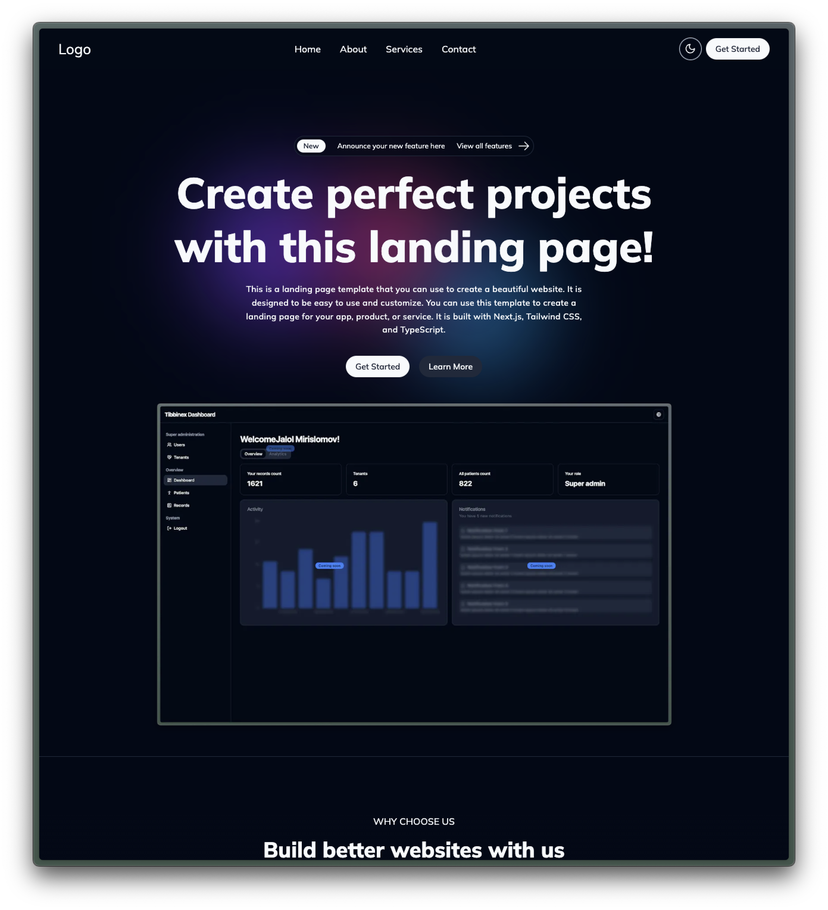

# SaaS Landing Page Kit

[](https://github.com/kiongosss/saas-landing-kit/blob/main/LICENSE)
[](https://www.npmjs.com/package/@kiongosss/saas-landing-kit)
[](https://github.com/kiongosss/saas-landing-kit/stargazers)

A modern, responsive, and customizable SaaS landing page template built with [Next.js](https://nextjs.org/), [TypeScript](https://www.typescriptlang.org/), and [Tailwind CSS](https://tailwindcss.com/). This template is designed to help you quickly launch your next SaaS product with a professional and conversion-focused landing page.

## 🌟 Features

- 🚀 **Built with Next.js 14** - Optimized for performance and SEO
- 🎨 **Tailwind CSS** - Utility-first CSS framework for easy customization
- 🌓 **Dark/Light Mode** - Built-in theme switching
- 📱 **Fully Responsive** - Works on all devices
- ⚡ **Fast & Optimized** - Great Lighthouse scores out of the box
- 🛠 **Easy to Customize** - Well-structured codebase
- 📝 **Contact Form** - Ready to connect to your backend
- 🎨 **Modern UI Components** - Beautiful, accessible components

## 📦 Installation

```bash
# Using npm
npx create-next-app -e https://github.com/kiongosss/saas-landing-kit my-saas-app

# Or clone the repository
git clone https://github.com/kiongosss/saas-landing-kit.git
cd saas-landing-kit
npm install
```

## 🚀 Getting Started

1. **Install dependencies**:
   ```bash
   npm install
   ```

2. **Run the development server**:
   ```bash
   npm run dev
   ```

3. **Open [http://localhost:3000](http://localhost:3000)** in your browser to see the result.

## 📄 Pages

- **Home** - Main landing page with hero section, features, and call-to-action
- **About** - Company information and mission
- **Services** - Detailed service offerings
- **Contact** - Contact form and information

## 🎨 Customization

### Environment Variables

Create a `.env.local` file in the root directory:

```env
NEXT_PUBLIC_SITE_NAME=My SaaS App
NEXT_PUBLIC_SITE_URL=https://my-saas-app.com
# Add other environment variables here
```

### Theme Colors

You can customize the color scheme by editing the `tailwind.config.ts` file:

```typescript
// tailwind.config.ts
theme: {
  extend: {
    colors: {
      primary: {
        DEFAULT: "#2563eb", // Change this to your brand color
        foreground: "#ffffff",
      },
    },
  },
},
```

## 🔧 Built With

- [Next.js](https://nextjs.org/) - The React Framework for Production
- [TypeScript](https://www.typescriptlang.org/) - TypeScript is a typed superset of JavaScript
- [Tailwind CSS](https://tailwindcss.com/) - A utility-first CSS framework
- [shadcn/ui](https://ui.shadcn.com/) - Beautifully designed components
- [Lucide Icons](https://lucide.dev/) - Beautiful & consistent icons

## 🤝 Contributing

Contributions are what make the open-source community such an amazing place to learn, inspire, and create. Any contributions you make are **greatly appreciated**.

1. Fork the Project
2. Create your Feature Branch (`git checkout -b feature/AmazingFeature`)
3. Commit your Changes (`git commit -m 'Add some AmazingFeature'`)
4. Push to the Branch (`git push origin feature/AmazingFeature`)
5. Open a Pull Request

## 📄 License

Distributed under the MIT License. See `LICENSE` for more information.

## 📧 Contact

KaseeMoka - [@kiongosss](https://github.com/kiongosss)

Project Link: [https://github.com/kiongosss/saas-landing-kit](https://github.com/kiongosss/saas-landing-kit)

## 🙏 Acknowledgments

- [Next.js Documentation](https://nextjs.org/docs)
- [Tailwind CSS Documentation](https://tailwindcss.com/docs)
- [shadcn/ui](https://ui.shadcn.com/)

## 🖼️ Preview

<div style="display: flex; gap: 1rem; flex-wrap: wrap;">
  
  
</div>

## 🏗️ Project Structure

```
.
├── app/                    # App Router
│   ├── about/             # About page
│   ├── contact/           # Contact page
│   ├── services/          # Services page
│   ├── layout.tsx         # Root layout
│   └── page.tsx           # Home page
├── components/             # Reusable components
│   ├── layout/            # Layout components
│   └── ui/                # UI components
├── data/                  # Data and content
├── public/                # Static files
└── styles/                # Global styles
```
